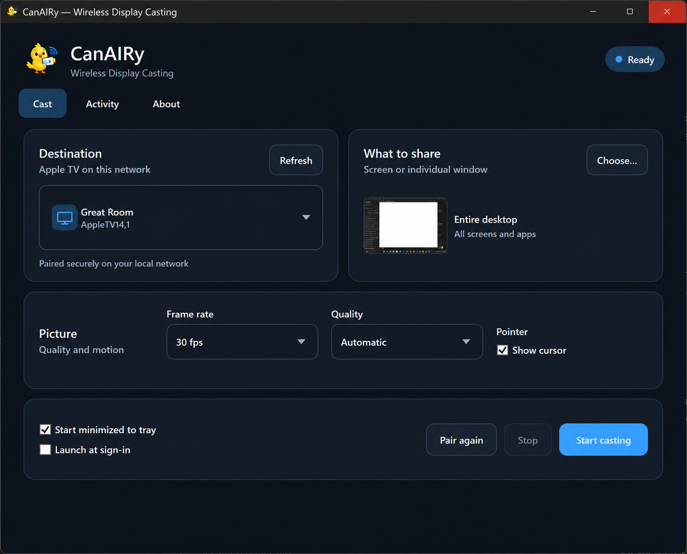
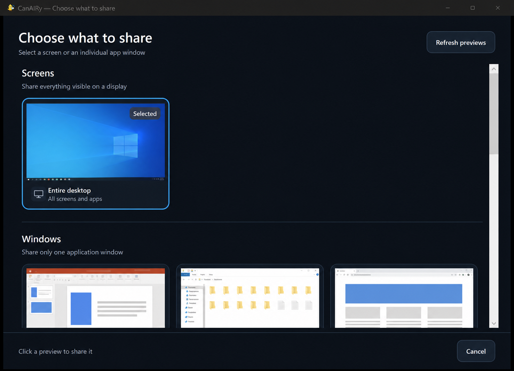

<div align="center">
  
  <h1>CanAIRy</h1>
  <p><strong>Wireless Display Casting for Apple TV</strong></p>
  <p>Cast your entire Windows desktop or one application window to an Apple TV on your local network.</p>
  <p>
    <a href="https://github.com/bglidwell/CanAIRy/actions/workflows/build.yml"></a>
    <a href="https://github.com/bglidwell/CanAIRy/releases/latest"></a>
    
  </p>
</div>

<p align="center">
  
</p>

## What it does

CanAIRy is a native Windows tray application that discovers Apple TVs, handles
PIN pairing, and streams a selected display or application window over your
LAN. It is designed to stay out of the way until you need it.

- Discover Apple TVs and compatible AirPlay receivers automatically.
- Pair using the PIN displayed by the receiver and remember known devices.
- Share an entire screen or only one visible application window.
- Choose from live visual previews, with screens listed first.
- Adjust frame rate, stream quality, and cursor visibility.
- Start, stop, and switch destinations from the system tray.
- Follow the Windows light or dark theme automatically.

## Choose exactly what to share

CanAIRy presents screens first, followed by scrollable previews of individual
application windows—similar to the sharing experience in Teams or Zoom.

<p align="center">
  
</p>

## Install

Download the current Windows x64 package from the
[latest release](https://github.com/bglidwell/CanAIRy/releases/latest):

- `CanAIRy-<version>-win-x64-setup.exe` — per-user installer with Start menu
  and optional desktop shortcuts. It supports silent installation and does not
  require administrator privileges.
- `CanAIRy-<version>-win-x64-portable.zip` — self-contained portable folder.

The application is not yet Authenticode-signed, so Windows may display a
SmartScreen warning for early releases.

## Quick start

1. Connect the Windows PC and Apple TV to the same local network.
2. Open CanAIRy and select the destination Apple TV.
3. Choose a screen or application window.
4. Select **Start casting** and enter the Apple TV PIN if prompted.
5. Use the CanAIRy tray menu to stop casting or switch sources later.

## Build from source

The desktop application targets .NET 10 and the AirPlay helpers are written in
Go. Build the Windows application with:

```powershell
dotnet build app\CanAIRy\CanAIRy.csproj -c Release
```

The GitHub **Build** workflow tests the Windows-compatible Go packages and
builds the native application on every push and pull request.

## Releases and WinGet

Pushing a semantic version tag builds the Go helpers, publishes a self-contained
Windows application, creates an Inno Setup installer and portable ZIP, generates
SHA-256 checksums, and attaches everything to a GitHub Release.

The proposed WinGet package identifier is `BobbyGlidwell.CanAIRy`. See
[distribution/WINGET.md](distribution/WINGET.md) for initial submission and
automated update instructions.

## Third-party components

The AirPlay sender is derived from `omarroth/doubletake`, and FFmpeg is included
for Windows screen capture and H.264 encoding. See
[THIRD-PARTY-NOTICES.md](THIRD-PARTY-NOTICES.md) and the license texts under
`sender/`.

---

<p align="center">Created by Bobby Glidwell</p>
